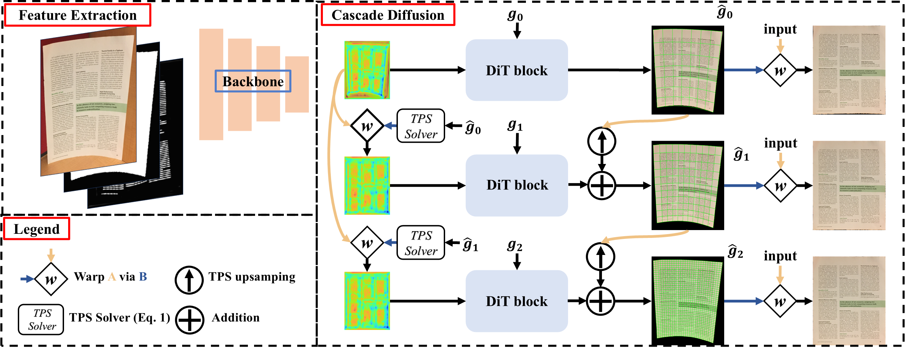

# Cascaded Coordinate Diffusion: Extending the Generative Paradigm for Document Dewarping

Document image geometric correction via a cascade diffusion-based geometric transformation field predictor.

## Overview



CCD predicts document dewarping transformations using a diffusion model with a DiT (Diffusion Transformer) backbone. The model generates a cascade of geometric transformation fields at three resolutions (two TPS control-point grids and one dense backward-mapping grid), conditioned on the input document image, a foreground segmentation mask, and a text-line segmentation mask.

## Environment

```bash
conda create -n CCD python=3.10.19
conda activate CCD

pip install torch==2.8.0+cu128 torchvision==0.23.0 --index-url https://download.pytorch.org/whl/cu128
pip install -r requirements.txt
```

The training and inference entry points require a CUDA-enabled GPU. Verify the installation with:

```bash
python -c "import torch, torchvision; print(torch.__version__, torchvision.__version__, torch.version.cuda, torch.cuda.is_available())"
```

If your environment reports an invalid `OMP_NUM_THREADS` value, set it to a positive integer before launching the code, for example `export OMP_NUM_THREADS=1`.

OCR metrics additionally require Tesseract OCR, `pytesseract`, `python-Levenshtein`, and `jiwer`. Visual benchmark metrics additionally require MATLAB and the MATLAB Engine for Python.

---

## Pretrained Weights

Download the pretrained weights from [Google Drive](https://drive.google.com/drive/folders/1TtBAgxAxq4ftiTOIEkm9EHhzBz8eqghg?usp=sharing), then place all downloaded weight files in the `checkpoints/` directory.

---

## Data Preparation

### Doc3D

```
dataset/Doc3d/
├── img/          # warped document images  (sub-folders 1-21)
├── target_img/   # flat GT images
├── grid2D/       # 2D control-point meshes (.mat)
├── grid3D/       # 3D control-point meshes (.mat)
├── grid_bm/      # normalised backward mappings (.npy)
└── recon/        # checkerboard reconstruction images
```

### UVDoc

```
dataset/UVDoc/
├── img/               # warped images (.png)
├── target_img/        # flat GT images
├── grid2d/            # 2D meshes (.mat)
├── grid3d/            # 3D meshes (.mat)
├── grid_bm/           # backward mappings (.npy)
├── seg/               # foreground masks (.mat)
├── metadata_sample/   # per-sample JSON metadata
└── benchmark/         # UVDoc benchmark split
    └── img/           # 50 benchmark images
```

### DocUNet Benchmark

```
dataset/DocUNet/
├── crop/     # distorted input images (512×512)
├── crop512/  # distorted input images (512×512, alternative format)
└── scan/     # flat GT scans
```

### DIR300

```
dataset/DIR300/
├── dist/   # distorted input images
└── gt/     # ground-truth flat images
```

---

## Training

Update dataset paths in `config/settings.py` (`class train`), then:

```bash
# Train on Doc3D + UVDoc (mixed)
python train.py
```

Training logs and checkpoints are saved to `checkpoints/Cascade_<dataset_name>/`.

---

## Evaluation

Set `config/settings.py` `eval.dataset_name` and run the corresponding script:

```bash
# DocUNet benchmark
python val.py          # set eval.dataset_name = "docunet"

# UVDoc benchmark
python val_uvdoc.py

# DIR300 benchmark
python val_dir300.py
```

Dewarped images are saved to `sampling/<dataset_name>/test/pred_dewarped/`.

### Computing Metrics

After generating predictions, compute MS-SSIM / LD / AD / CER / ED:

```bash
# UVDoc
python evaluation/UVDocBenchmark_eval.py \
    --uvdoc-path /path/to/dataset/UVDoc/benchmark \
    --pred-path sampling/uvdoc/test/pred_dewarped \
    --save-path sampling/uvdoc/test

# DocUNet
python evaluation/docUnet_eval.py \
    --docunet-path /path/to/dataset/DocUNet/scan \
    --pred-path sampling/docunet/test/pred_dewarped \
    --inputs-path /path/to/dataset/DocUNet/crop \
    --save-path sampling/docunet/test

# DIR300
python evaluation/dir300_eval.py \
    --dir300-path /path/to/dataset/DIR300/gt \
    --pred-path sampling/dir300/test/pred_dewarped \
    --inputs-path /path/to/dataset/DIR300/dist \
    --save-path sampling/dir300/test
```

> Visual metrics (MS-SSIM, LD, AD) require MATLAB Engine for Python.

---

## Single-Image Inference

```bash
python infer.py --image /path/to/distorted_doc.jpg

# Specify output path and model
python infer.py \
    --image /path/to/distorted_doc.jpg \
    --output /path/to/dewarped.png \
    --model-path checkpoints/best_model.pt \
    --device cuda:0
```

The output is saved at the original input resolution.

---

## Acknowledgements

We sincerely thank the following projects, since our code is largely based on or inspired by
[improved-diffusion](https://github.com/openai/improved-diffusion),
[DiT](https://github.com/facebookresearch/DiT), and
[DvD](https://github.com/hanquansanren/DvD),
[UVDoc](https://github.com/tanguymagne/UVDoc),
[DewarpNet](https://github.com/cvlab-stonybrook/DewarpNet), and
[DocScanner](https://github.com/fh2019ustc/DocScanner).
